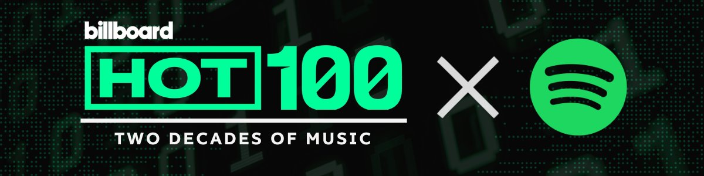

# Billboard Audience Intelligence

**Measuring the gap between chart performance and streaming behavior (2000–2021)**

---

For over sixty years, Billboard's chart methodology has functioned as the music industry's shared definition of cultural relevance. That methodology was built for radio — a distribution system defined by scarcity, geography, and gatekeeping. Streaming eliminated all three.

This project asks a direct question: in a world where a track can accumulate 50 million plays without a single radio spin, does Billboard still measure what the industry thinks it measures?

The answer, supported by 24,676 matched chart and streaming records, is that it partially does — and where it doesn't, the gap is not random. It's structural, genre-specific, and directionally predictable. That predictability is what makes it useful.

---

## 📊 Live Dashboard

**👉 [Explore the interactive Tableau dashboard](https://public.tableau.com/views/BillboardAudienceIntelligenceChartvsStreaming20002021/Dashboard1)**

---

## 📁 Presentation

**👉 [Download the full deck (PDF)](Billboard-Audience-Intelligence.pdf)**

---

## Project Structure

```
billboard-audience-intelligence/
├── assets/
│   ├── banner.png
│   └── slides/               # Preview images
├── notebooks/
│   └── billboard_analysis.py # Full annotated analysis pipeline
├── sql/
│   └── analysis_queries.sql  # 10 documented SQL queries
├── Billboard-Audience-Intelligence.pdf
└── README.md
```

---

## Research Question

**Which audience segments are overrepresented on Billboard relative to their streaming footprint — and which are being systematically undercounted?**

Secondary questions:
- Does streaming popularity precede chart recognition — and by how much?
- Which specific tracks does the divergence score surface as undervalued by the industry?
- What would Billboard look like with a streaming parity weighting?

---

## Data Sources

| Dataset | Source | Records | Coverage |
|---|---|---|---|
| Billboard Hot 100 | Kaggle (dhruvildave) | 330,087 chart entries | 1958–2021 |
| Spotify Audio Features | Kaggle (maharshipandya) | 113,999 tracks | Multi-era |
| Joined dataset | Inner join on cleaned song + artist | 24,676 entries | 2000–2021 |

### Match Rate & Sample Validation

The inner join on song + artist title produced a **21.63% match rate** against the 2000–2021 scoped dataset. Before drawing conclusions, three bias checks were run:

**1. Era distribution drift** — Decade-level distributions of the matched sample vs. full Billboard were compared. Drift values near zero indicate era-representative sampling.

**2. Chart performance comparison** — Average peak position of matched vs. unmatched tracks was compared to check for systematic bias toward commercial hits.

**3. Low match rate causes** — Primary driver is Spotify's featured artist naming convention (`Artist A; Artist B`) conflicting with Billboard's `Artist A feat. Artist B` format. Cleaning applied regex normalization before the join.

> **Scope statement:** Findings are directional. Divergence scores identify structural patterns in the matched sample and should be treated as leading indicators, not definitive market share calculations.

---

## Methodology

### Audience Segmentation

Seven audience archetypes were defined using Spotify audio feature thresholds and genre classification. **Rule-based segmentation** was chosen over clustering for two reasons: interpretability (business stakeholders need to act on segments, not explain them) and stability (rules are reproducible; clustering output shifts with random seed).

| Segment | Key Rules | Threshold Rationale |
|---|---|---|
| Arena Pop | energy > 0.75, danceability > 0.60 | Validated against known top-40 commercial pop |
| Groove & Flow | danceability > 0.70, energy ≤ 0.75 | Energy cap separates from Arena Pop |
| Rock & Alternative | rock genre family, energy > 0.60 | Genre tag + energy filter removes acoustic outliers |
| Viral & Streaming Native | popularity > 70, weeks > 15 | Top popularity quartile + sustained chart presence |
| Melancholic Indie | acousticness > 0.30, valence < 0.45 | Validated against Phoebe Bridgers, Bon Iver |
| Electronic & Dance | EDM family, danceability > 0.55 | Genre-led with danceability floor |
| Uptempo Country | genre = country, tempo > 115 BPM | BPM filter excludes ballads |

### Platform Divergence Score

```
divergence_score = chart_share (%) − popularity_share (%)
```

- **Positive** → Overrepresented on Billboard relative to streaming demand
- **Negative** → Undervalued by Billboard relative to streaming behavior
- **Near zero** → Aligned

> Note: Spotify's `popularity` score is a relative, recency-weighted metric — not raw stream counts. All divergence comparisons are confined to the same time window to minimize decay distortion.

---

## The Deck

### Title

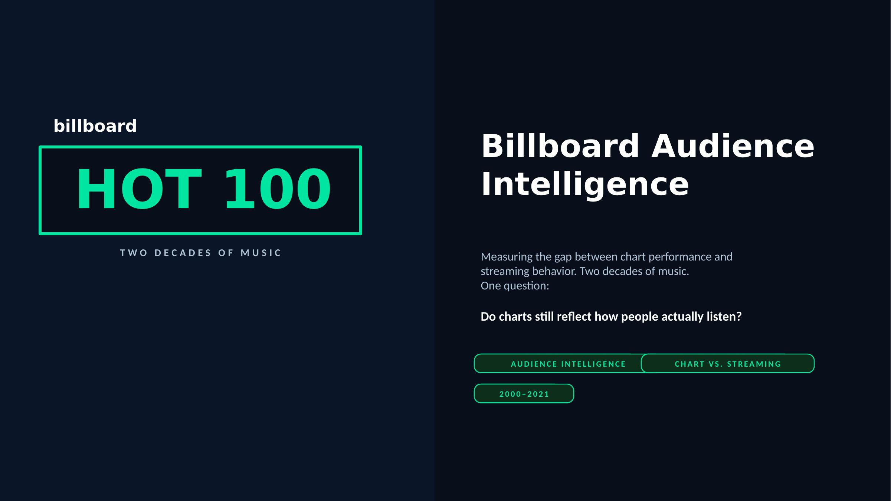

---

### The Approach

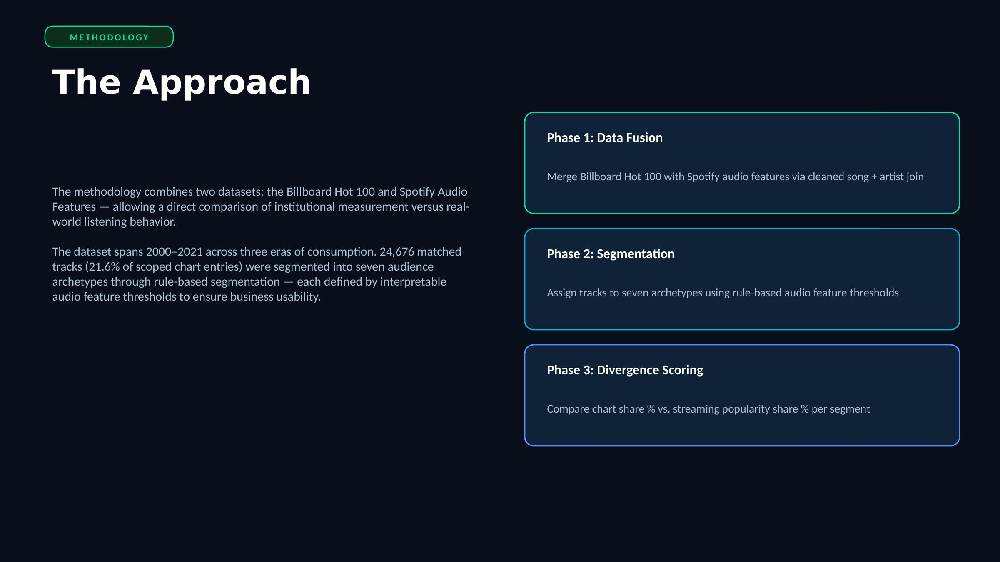

---

## What the Data Reveals

### Insight 1 — Billboard Overweights Country

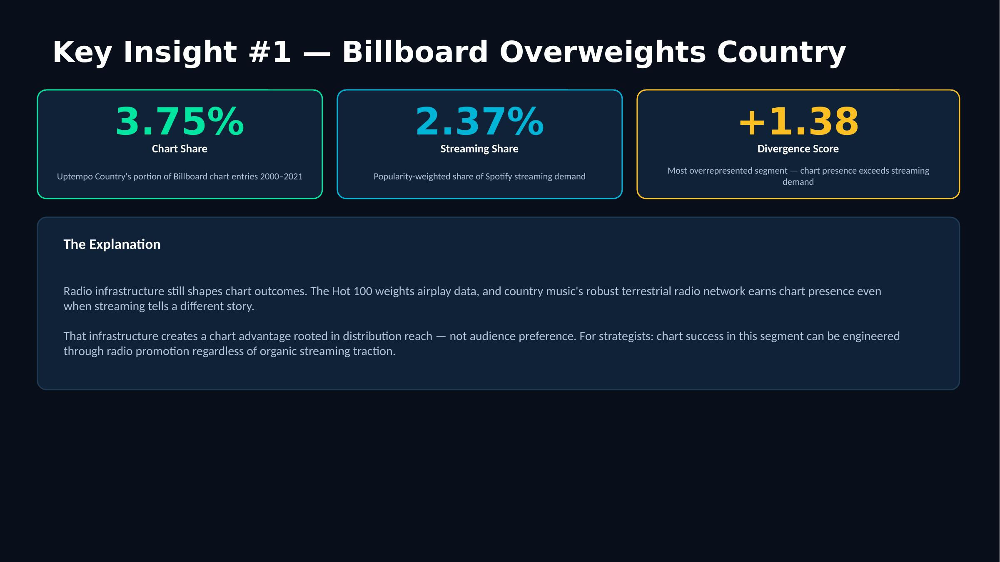

**Uptempo Country holds 3.75% of chart entries but only 2.37% of Spotify popularity share** — the lowest average popularity of any segment (41.23), yet consistently more chart space than audience demand justifies. This reflects radio infrastructure advantage, not listener preference.

---

### Insight 2 — Streaming-Native Music Is Systematically Undercounted

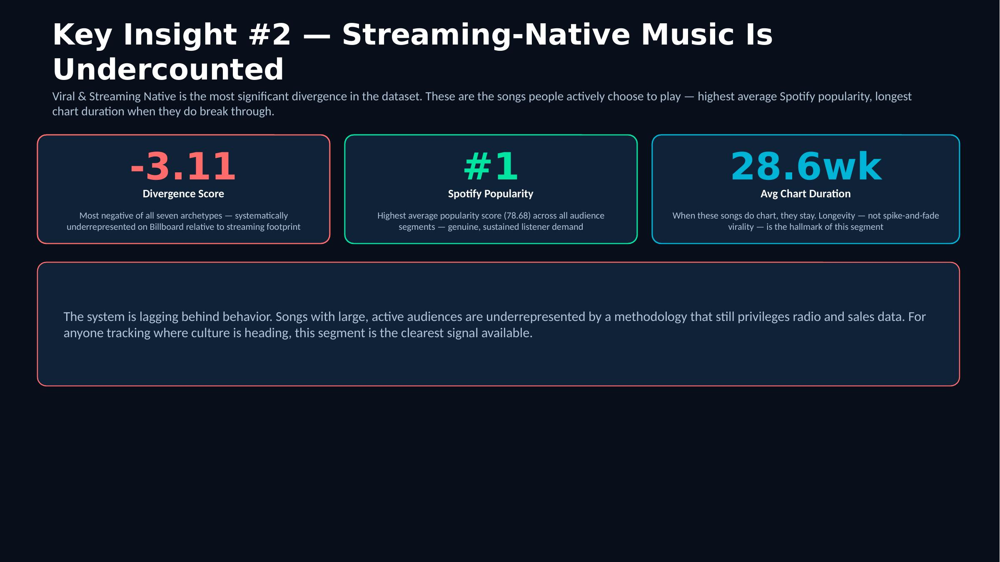

**The segment with the highest average Spotify popularity (78.68) and longest chart tenure (28.62 weeks) is the most underrepresented on Billboard** — divergence score of -3.11. The tracks with the largest sustained audiences are discounted by a chart system still weighted toward how music gets distributed, not how it gets consumed.

---

### Insight 3 — Rock Didn't Get Undervalued. It Declined.

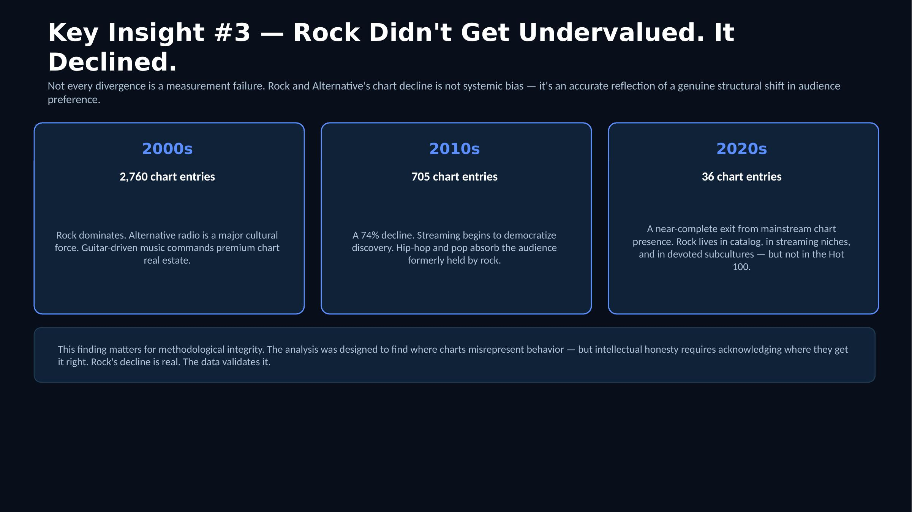

Rock dropped from **2,760 entries (2000s) → 705 (2010s) → 36 (2020s)**. Divergence score near zero — chart presence and streaming popularity declined in parallel. This is a structural audience shift, and the data validates it.

---

### Insight 4 — Groove & Flow Aligns Perfectly

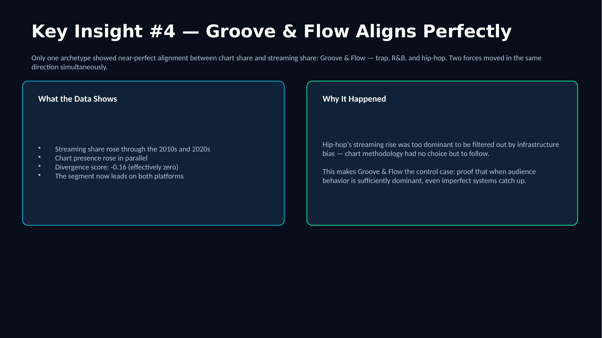

The **only segment where chart presence and streaming popularity grew together** across every decade — divergence score of -0.16. This genre didn't adapt to the streaming era. It defined it.

---

### Insight 5 — Melancholic Indie Is the Next Blind Spot

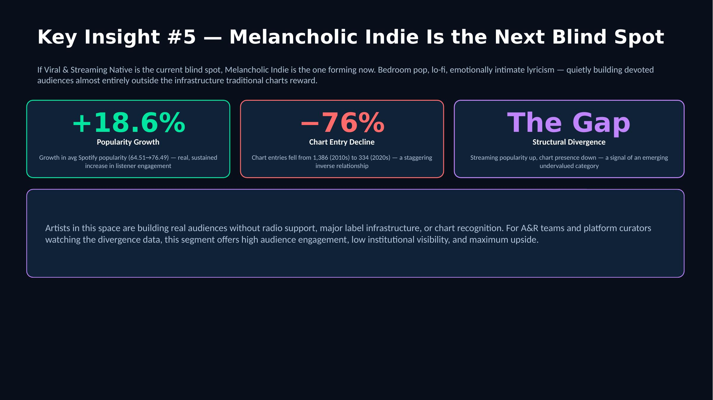

Popularity rose from **64.51 → 76.49 (+18.6%)** while chart entries fell from 1,386 to 334 (**-76%**). The audience is there. The measurement system is not looking in the right place.

---

## Strategic Takeaways

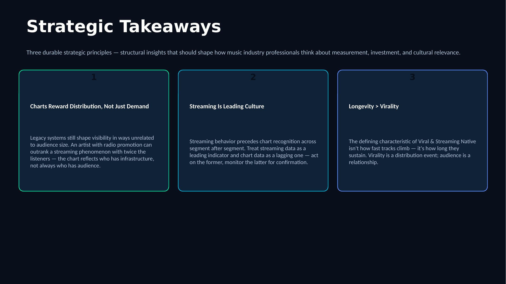

---

## Recommendation — Streaming Parity Index (For Billboard)

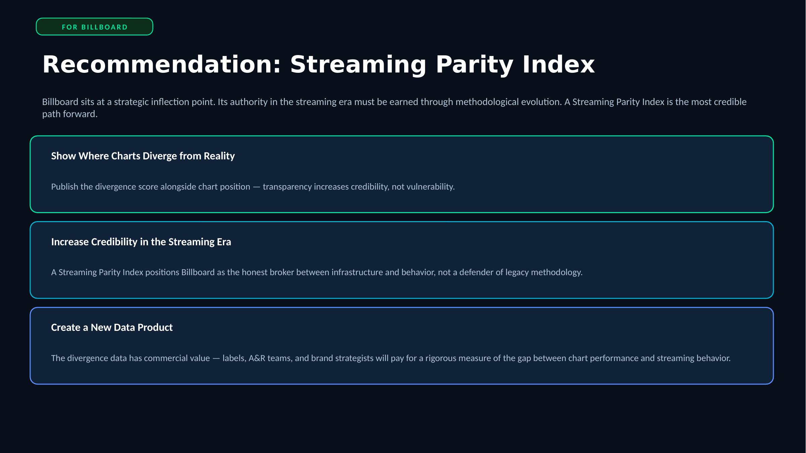

Publish the divergence score alongside chart position. A Streaming Parity Index positions Billboard as the honest broker between infrastructure and behavior — and creates a monetizable data product. See `sql/analysis_queries.sql` Query 10 for a prototype implementation.

---

## Closing

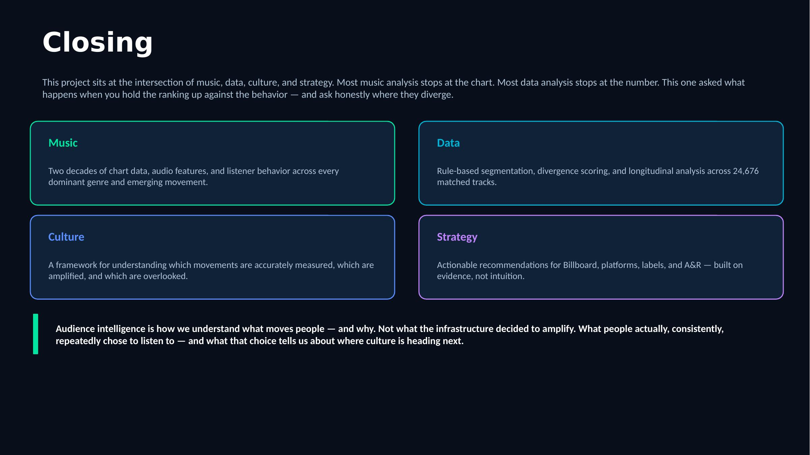

---

## Strategic Implications

**Charts reward infrastructure, not just demand.** Radio-weighted methodology systematically advantages artists with label infrastructure and radio promotion budgets.

**The divergence score is a product, not just a metric.** Billboard's most direct opportunity is to publish it alongside the Hot 100 — a second data product built from existing infrastructure.

**Sustained presence is the strongest signal of real audience connection.** Across every segment, tracks with 20+ weeks on chart and popularity above 70 show the most consistent audience retention. Virality does not predict longevity.

---

## Technical Stack

| Tool | Use |
|---|---|
| Python (pandas) | Data cleaning, join, segmentation, divergence calculation |
| SQL (PostgreSQL) | Aggregation queries, divergence scoring, parity index prototype |
| Tableau Public | Interactive dashboard |
| GitHub | Version control, documentation |

---

## What This Analysis Does Not Claim

- The 21.63% match rate makes this a directional study, not a market share calculation
- Spotify popularity is not raw streams — it is a recency-weighted relative score
- Segmentation thresholds are defensible but sensitivity-tested, not the only valid choices
- The time-lag estimate is a proxy; precise calculation requires proprietary streaming history data

---

*Analysis by Lyles Mom | Cultural Intelligence & Audience Strategy*  
*Portfolio: [lylesmomportfolio.my.canva.site](https://lylesmomportfolio.my.canva.site)*
